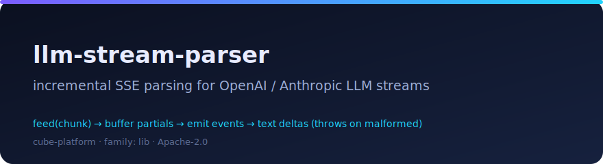

# llm-stream-parser

<p align="center"></p>

*Incrementally parse OpenAI / Anthropic / compatible LLM SSE streams into events and text deltas; parsers throw on malformed payloads.*

[](../INDEX.md)
[](./package.json)
[](./LICENSE)

## Overview

Both OpenAI and Anthropic stream chat responses as **Server-Sent Events** — but
the framing and the payload shape differ:

- **OpenAI:** events have no `event:` line; each `data:` line carries JSON with
  `choices[0].delta.content`; the stream terminates with `data: [DONE]`.
- **Anthropic:** events carry an `event:` line (`message_start`,
  `content_block_delta`, …); the delta type lives inside the JSON
  (`text_delta` for text, `input_json_delta` for tool-call arguments).

`llm-stream-parser` is a small, transport-agnostic, **zero-dependency** parser
for exactly this. It works in two layers:

1. **`SSEParser`** — a low-level incremental framer. Feed it raw chunks; it
   returns whole SSE events as they complete and **buffers** anything partial
   (a delta split across chunk boundaries, a multibyte char split mid-byte)
   until the rest arrives, so output never depends on chunk size.
2. **Extractors** (`openAIText`, `anthropicText`) and the high-level
   **`streamText`** / **`iterateEvents`** helpers — pull the text deltas (or
   the raw events) out of a framed stream.

The library is **pure and deterministic**: it consumes a stream the caller
hands it (e.g. `fetch().body`) and never opens I/O of its own — so there are
**no seams, no fakes, and no live-check**. Everything runs offline.

**Parsers throw.** An *in-flight partial* (an event whose separator hasn't
arrived yet) is buffered, which is correct. But once an event is fully framed —
or the stream flushes at end-of-input — its payload is a *complete* value: if a
non-`[DONE]` JSON payload is malformed or **truncated** (a dropped connection
leaving a half-emitted delta), the extractor throws `SSEPayloadError` rather
than silently returning an empty result.

## Usage

Runs on [Bun](https://bun.sh) directly from source — no build step.

```sh
bun test          # the suite (pure functions — deterministic, offline)
bunx tsc --noEmit # typecheck
```

### Incremental parse — stream text deltas

`streamText` auto-detects the Anthropic vs OpenAI shape and yields only the
visible text, even when deltas are split across chunk boundaries:

```ts
import { streamText } from "llm-stream-parser";

// A delta is split mid-payload across two chunks — buffered, then completed.
async function* chunks() {
  yield 'data: {"choices":[{"delta":{"content":"Hel';
  yield 'lo, world"}}]}\n\n';
  yield "data: [DONE]\n\n";
}

let out = "";
for await (const text of streamText(chunks())) out += text;
console.log(out); // "Hello, world"
```

Against a live response, hand it `fetch().body`:

```ts
const res = await fetch(url, { method: "POST", body });
for await (const chunk of streamText(res.body!)) process.stdout.write(chunk);
```

### Raw events / tool-call arguments

```ts
import { iterateEvents } from "llm-stream-parser";

let toolArgs = "";
for await (const ev of iterateEvents(res.body!)) {
  if (ev.event === "content_block_delta") {
    const j = JSON.parse(ev.data);
    if (j.delta.type === "input_json_delta") toolArgs += j.delta.partial_json;
  }
}
const args = JSON.parse(toolArgs); // complete tool-call args
```

### Malformed input throws (never silent-empty)

```ts
import { openAIText, SSEPayloadError } from "llm-stream-parser";

// A fully-framed event whose JSON payload is broken or truncated:
try {
  openAIText({ data: '{"choices":[{"delta":{"content":"cut o' }); // truncated JSON
} catch (err) {
  console.log(err instanceof SSEPayloadError); // true — surfaced, not swallowed
}

// The [DONE] sentinel and textless control events are NOT errors — they yield null:
console.log(openAIText({ data: "[DONE]" })); // null
```

## Part of the Cube Platform

A `lib`-family cube — a zero-dep streaming-parser micro-library. See the
workspace [INDEX.md](../INDEX.md) for sibling cubes.

---

Apache-2.0 · Vlad Bordei &lt;vlad@vollko.com&gt; · https://github.com/p-vbordei
